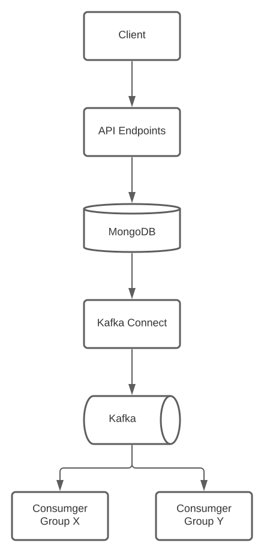

# API Service Template

A template for an API service.

A client performs CRUD operations on resources.

Changes on resources are available via [Change Streams](https://docs.mongodb.com/manual/changeStreams/),
which can be picked up by [MongoDB Kafka Connector](https://docs.mongodb.com/kafka-connector/current/kafka-source/)
and published to [Kafka](https://kafka.apache.org/) for further fan-out. 



## Endpoints

```shell
curl -XGET localhost:8080/v1/ping
curl -XGET localhost:8080 /v1/panic

curl -XPOST /v1/records -d '{"name": "one", "description":"The 1st one"}'
curl -XGET /v1/records/:id
```

## Test

```shell
docker-compose up -d
cd api
make test
```

## Build

```shell
cd api
make build
```